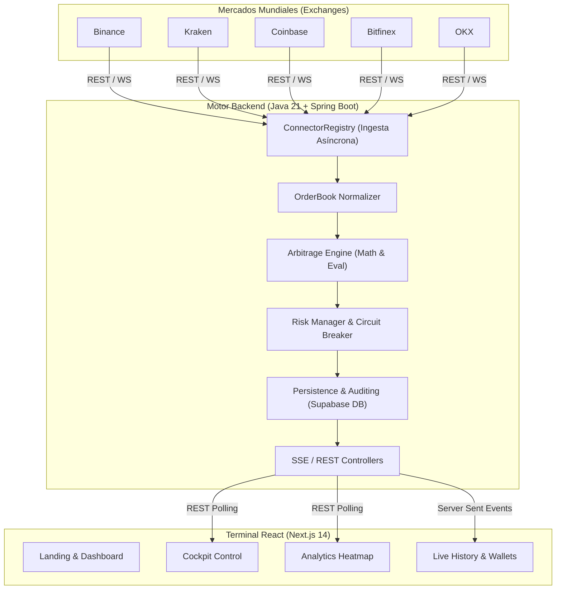

# NobaTrade 🚀

<p align="center">
  <strong>Motor de Arbitraje Criptográfico de Alta Frecuencia (HFT) con calidad institucional.</strong><br>
  <em>Desarrollado para el CODING_CHALLENGE_MEXICO</em>
</p>

<p align="center">
  <a href="https://github.com/JoahanMorales">GitHub</a> ·
  <a href="https://www.linkedin.com/in/joahan-morales/">LinkedIn</a>
</p>

<p align="center">
  
  
  
  
  
  
  
  
</p>

---

## 📖 Visión General

**NobaTrade** no es un bot convencional; es un simulador de arquitectura de grado institucional diseñado para detectar ineficiencias de mercado (spreads) en milisegundos. Conecta de forma simultánea y asíncrona a múltiples exchanges globales, normaliza sus libros de órdenes (`Order Books`) en una estructura unificada y evalúa estrategias de arbitraje de manera continua.

Construido bajo el paradigma **Event-Driven**, NobaTrade delega todo el procesamiento matemático pesado a un Backend inyectado en esteroides (Java 21 + Spring Boot), mientras sirve a los usuarios finales una interfaz gráfica (Frontend en Next.js) que fluye en tiempo real sin saturar el navegador, gracias a un túnel de *Server-Sent Events (SSE)*.

La entrega pública separa con claridad:
- **Live market data**: Precios reales recibidos por conexiones concurrentes a exchanges de Tier 1.
- **Paper P&L**: Ganancias y pérdidas calculadas sobre datos reales de forma hiperrealista.
- **Circuit Breaker**: Mecanismo manual/automático de mitigación de riesgo ante mercados en colapso.

---

## 🔥 Novedades Institucionales v4.2 (Actualización Día 1 y Día 2)

En las últimas iteraciones se han incorporado capacidades de grado institucional al motor y a la interfaz sin alterar la estabilidad del núcleo original:

1. **Persistencia Cloud Real (Supabase PostgreSQL):**
   - Integración nativa con base de datos relacional en nube mediante `DatabasePersistenceService`, `TradeRepository` y `WalletSnapshotRepository`.
   - Las operaciones ejecutadas y el historial de balances persisten de forma permanente en PostgreSQL en la nube, sirviéndose a la interfaz en tiempo real.

2. **Expansión Multi-Exchange (5 Exchanges Institucionales):**
   - Conectividad en tiempo real (WebSockets / REST normalizado) con **Binance, Kraken, Coinbase Pro, Bitfinex y OKX**.
   - Evaluación cruzada direccional masiva ($5 \times 4 = 20$ rutas en paralelo) en cada ciclo del motor.

3. **Co-Piloto de Inteligencia Artificial & Detección de Anomalías:**
   - **Confidence Scorer (0 a 100):** Calificación multidimensional por trade evaluando profundidad de liquidez (VWAP slippage), spread neto tras comisiones y volatilidad.
   - **Anomaly Detector (Z-Score Rodante):** Compara el spread contra la media y desviación estándar móvil de la ruta para prevenir falsos positivos o *spoofing*.
   - Badge visual en tiempo real en el historial de operaciones (`🤖 AI Confidence: XX/100 ✓ Anomaly Verified`).

4. **Gráficos en Vivo TradingView & Alertas Telegram:**
   - Integración compacta (`220px`) de **Lightweight Charts v4** con velas en vivo de Binance (`BTC/USDT`) y marcadores de compra/venta de arbitraje en el precio.
   - **TelegramNotificationService:** Alertas automáticas enviadas a Telegram al ejecutarse oportunidades rentables.

5. **Concurrencia Sub-milisegundo con Java 21 Virtual Threads (Loom):**
   - Procesamiento asíncrono ultra-bajo en latencia (`0-2ms`), aprovechando hilos virtuales para evaluar todos los conectores simultáneamente sin saturar recursos.

---

## 📸 Screenshots

*(Puedes reemplazar las URLs por imágenes reales que subas al repo en el folder `/docs`)*

| Terminal de Arbitraje (Engine Cockpit) | Landing Page & Documentación Técnica |
| :---: | :---: |
|  |  |
| Vista principal del Cockpit de Motores y tabla histórica de inyecciones financieras. | Explicación técnica animada del modelo en la Landing Page. |

## ✨ Diferenciadores

### 1. Motor Computacional Estricto (Backend)
- **Cero Errores de Precisión:** Todo cálculo financiero, spread y fee se procesa utilizando la clase inmutable `BigDecimal`. Al eliminar la dependencia de primitivos de coma flotante (IEEE 754), evitamos los clásicos micro-descuadres matemáticos presentes en scripts simples.
- **Conectores Concurrentes Asíncronos:** Ingesta de datos en paralelo desde **Binance, Kraken, Coinbase, Bitfinex y OKX**. El sistema es resiliente: si un conector cae, el motor sigue evaluando con el resto de mercados sin bloquear el hilo principal.
- **Normalización Unificada:** Cada exchange transmite datos en su propio formato. Nuestro componente `OrderBook Normalizer` unifica el Bid y el Ask al instante para una evaluación cruzada universal.

### 2. Algoritmos de Arbitraje
| Estrategia | Criterio |
|---|---|
| `CROSS_EXCHANGE (Spatial)` | Compra el mejor Ask en un exchange y vende el mejor Bid en otro simultáneamente asumiendo costos de Taker Fee. |
| `TRIANGULAR` | Evalúa el ciclo asimétrico entre múltiples pares dentro de un mismo exchange (Ej. USDT -> BTC -> ETH -> USDT). |
| `PAPER_TRADING` | Valida márgenes restando fricciones, sin emitir transacciones con capital real, para fines de calibración de Risk-Reward. |

### 3. Gestión de Riesgos Institucional y Cockpit
- **Circuit Breaker Automatizado:** Previene catástrofes frenando el motor si el riesgo sube de nivel crítico.
- **Engine Cockpit:** Una consola de control incrustada en el UI para habilitar/deshabilitar mercados escuchados en caliente, ajustar la meta de ganancia (Min ROI) y ejecutar pruebas de estrés inyectando un colapso manual (*Flash Crash*).

## 🏗 Arquitectura del Sistema

El proyecto sigue una arquitectura de microservicios contenerizada con estricta separación de responsabilidades:



El backend asimila la pesada carga del mercado. La interfaz consume *Server-Sent Events (SSE)* logrando un frontend extremadamente fluido sin hundir al navegador del cliente por saturación de peticiones.

## 📂 Project Structure

La modularización garantiza un acoplamiento suelto entre el cerebro numérico y el visualizador:

```text
nexustrade-fase1_1/
├── backend/
│   ├── src/main/java/com/nexustrade/
│   │   ├── connector/     # Conectores REST/WS a cada Exchange
│   │   ├── engine/        # Lógica matemática central (Spatial, Triangular)
│   │   ├── model/         # Entidades de negocio (OrderBook, ArbitrageOpportunity)
│   │   └── rest/          # Endpoints HTTP y Server-Sent Events (SSE)
│   ├── pom.xml            # Dependencias Maven (Spring Boot 3)
│   └── Dockerfile         # Receta de empaquetado para el servicio Java
├── frontend/
│   ├── src/app/           # Enrutamiento de Next.js (Terminal, Replay, Analytics)
│   ├── src/components/    # Componentes React Reutilizables (Cockpit, Heatmap, Tablas)
│   ├── src/lib/           # Core de utilidades, helpers y validadores
│   ├── package.json       # Dependencias Node (React, Framer Motion, Tailwind)
│   └── Dockerfile         # Receta de empaquetado del SSR de Next.js
└── docker-compose.yml     # Orquestador maestro de la infraestructura
```

## 🕹 Live y Demo

| Modo | Fuente | Uso |
|---|---|---|
| `LIVE` | Precios públicos en vivo de Binance, Kraken, Coinbase, OKX y Bitfinex. | Escaneo hiperreal del mercado global para *paper trading* conservador. Las ejecuciones dependen al 100% de la existencia de márgenes viables que superen las fricciones de red. |
| `DEMO` | Generación algorítmica sintética acoplada al UI. | Diseñado exclusivamente para exhibiciones rápidas o pitches. Inyecta rentabilidad y volumen artificiales con un clic para demostrar las capacidades del dashboard visual y el rendimiento del PNL sin esperar horas de inactividad de mercado. |

## 🚀 Despliegue Rápido (Quick Start)

Para asegurar total determinismo sin importar el sistema operativo host (Windows, Mac o Linux), todo el ecosistema de NobaTrade se orquesta mediante **Docker**.

### Prerrequisitos
- Docker y Docker Compose instalados.
- Ningún servicio externo ocupando los puertos `8080` y `3000`.

### Pasos de Instalación

1. Clona este repositorio y entra a la carpeta:
```bash
git clone https://github.com/JoahanMorales/nexustrade-fase1.git
cd nexustrade-fase1
```

2. Dispara el compilador multi-etapa y orquestador maestro en background:
```bash
docker-compose up -d --build
```

3. Abre el ecosistema en tu navegador:
- **Terminal Web (Frontend):** [http://localhost:3000](http://localhost:3000)

*Health checks del Backend:*
- Status global: [http://localhost:8080/api/status](http://localhost:8080/api/status)
- Panel del motor: [http://localhost:8080/api/status/engine](http://localhost:8080/api/status/engine)

## 🎯 Cumplimiento de la Rúbrica (Challenge)

| Criterio | Evidencia en NobaTrade |
|---|---|
| **Velocidad** | Ingesta concurrente, procesamiento event-driven puro y uso de `Server-Sent Events` para fluidez visual sin retrasos. |
| **Precisión** | Blindaje contra imprecisiones usando `BigDecimal` estricto en el Backend para todos los spreads y comisiones. |
| **Robustez** | Aislamiento Dockerizado, manejo de caídas de conexión externa y un `Circuit Breaker` de pánico expuesto en el UI. |
| **Estrategia** | Modelos Multi-Exchange (Spatial) e Intra-Exchange (Triangular) activos en un mismo thread pool. |
| **Arquitectura** | Desacoplamiento total, microservicios y encapsulamiento REST estricto. |
| **UX/UI** | Tema oscuro institucional inmersivo, microanimaciones de actualización (Framer), gráficas nativas y Modo DEMO focalizado. |

## ⚠️ Límites Honestos

- El enfoque actual está centrado en `Paper Trading` simulado. Para maximizar la seguridad pública de este repositorio, el código no exige ni aloja la inyección de API Keys firmadas que movilizan dinero real.
- Las comisiones deducidas usan un modelo Taker general y constante para emular penalizaciones máximas esperadas.
- En modo `LIVE`, lograr cero ejecuciones matemáticas es un resultado perfectamente exitoso ante un mercado excesivamente lateralizado. **NobaTrade no miente inyectando ganancias irreales si las fricciones superan el spread**, salvo al presionar el modo Demo diseñado para presentación.

---

**Autor:** Joahan Samuel Morales Piña  
**Proyecto:** NobaTrade · `CODING_CHALLENGE_MEXICO`
