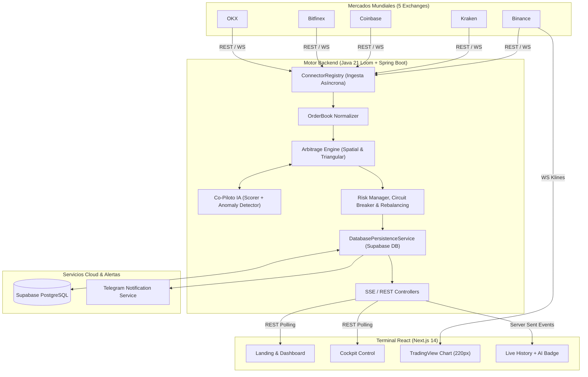

# NobaTrade 🚀

<p align="center">
  <strong>Motor de Arbitraje Criptográfico de Alta Frecuencia (HFT) con calidad institucional.</strong><br>
  <em>Desarrollado para el CODING_CHALLENGE_MEXICO</em>
</p>

<p align="center">
  <a href="https://github.com/JaavRJ">GitHub</a> ·
  <a href="https://www.linkedin.com/in/javier-reyna-ju%C3%A1rez-779a5827a/">LinkedIn</a>
</p>

<p align="center">
  
  
  
  
  
  
  
  
</p>

---

## 📖 Visión General

**NobaTrade** no es un bot convencional; es un simulador de arquitectura de grado institucional diseñado para detectar ineficiencias de mercado (spreads) en milisegundos. Conecta de forma simultánea y asíncrona a **5 exchanges globales (Binance, Kraken, Coinbase, Bitfinex y OKX)**, normaliza sus libros de órdenes (`Order Books`) en una estructura unificada y evalúa estrategias de arbitraje de manera continua aprovechando la concurrencia masiva de **Java 21 Virtual Threads (Project Loom)**.

Construido bajo el paradigma **Event-Driven**, NobaTrade delega todo el procesamiento matemático pesado a un Backend inyectado en esteroides (Java 21 + Spring Boot), valida cada operación con un **Co-Piloto de Inteligencia Artificial (AI Confidence Scorer + Anomaly Detector)** y persiste su contabilidad y auditoría en **Supabase PostgreSQL Cloud DB**, mientras sirve a los usuarios finales una interfaz gráfica (Frontend en Next.js) que fluye en tiempo real sin saturar el navegador, gracias a un túnel de *Server-Sent Events (SSE)*.

La entrega pública separa con claridad:
- **Live market data**: Precios reales recibidos por conexiones concurrentes a exchanges de Tier 1.
- **Paper P&L Auditado**: Ganancias y pérdidas calculadas sobre datos reales de forma hiperrealista y guardadas en base de datos PostgreSQL.
- **Circuit Breaker & Rebalanceo**: Mecanismos automáticos/manuales de mitigación de riesgo ante mercados en colapso y rebalanceo de carteras con asimetría extrema.

## 📸 Screenshots

*(Puedes reemplazar las URLs por imágenes reales que subas al repo en el folder `/docs`)*

| Terminal de Arbitraje (Engine Cockpit) | Landing Page & Documentación Técnica |
| :---: | :---: |
|  |  |
| Vista principal del Cockpit de Motores y tabla histórica de inyecciones financieras. | Explicación técnica animada del modelo en la Landing Page. |

## ✨ Diferenciadores

### 1. Motor Computacional Estricto (Backend)
- **Cero Errores de Precisión:** Todo cálculo financiero, spread y fee se procesa utilizando la clase inmutable `BigDecimal`. Al eliminar la dependencia de primitivos de coma flotante (IEEE 754), evitamos los clásicos micro-descuadres matemáticos presentes en scripts simples.
- **Conectores Concurrentes Asíncronos (5 Exchanges):** Ingesta de datos en paralelo desde **Binance, Kraken, Coinbase, Bitfinex y OKX** aprovechando la concurrencia masiva de **Java 21 Virtual Threads (Project Loom)** para lograr latencias sub-milisegundo (~0-2ms). El sistema es resiliente: si un conector cae, el motor sigue evaluando con el resto de mercados sin bloquear el hilo principal.
- **Normalización Unificada:** Cada exchange transmite datos en su propio formato. Nuestro componente `OrderBook Normalizer` unifica el Bid y el Ask al instante para una evaluación cruzada universal sobre 20 rutas direccionales por tick.

### 2. Algoritmos de Arbitraje & Co-Piloto IA
| Estrategia / Filtro | Criterio |
|---|---|
| `CROSS_EXCHANGE (Spatial)` | Compra el mejor Ask en un exchange y vende el mejor Bid en otro simultáneamente asumiendo costos de Taker/Maker Fee y retiro de red. |
| `TRIANGULAR` | Evalúa el ciclo asimétrico entre múltiples pares dentro de un mismo exchange (Ej. en Binance: `USDT -> BTC -> ETH -> USDT`) capturando beneficio spot sin fricción blockchain. |
| `CO-PILOTO IA (Scoring & Anomalías)` | Califica cada oportunidad detectada con un **Confidence Score (0-100)** y valida desviaciones contra un **Anomaly Detector (Z-Score rodante)** para filtrar manipulación de libro (*spoofing*) antes de ejecutar. |
| `PAPER_TRADING` | Valida márgenes restando fricciones, sin emitir transacciones con capital real, para fines de calibración de Risk-Reward. |

### 3. Gestión de Riesgos Institucional, Persistencia y Cockpit
- **Circuit Breaker Automatizado:** Previene catástrofes frenando el motor si el riesgo sube de nivel crítico (pérdidas consecutivas o caída de drawdown máxima).
- **Servicio de Rebalanceo de Inventario (`RebalancingService`):** Supervisa la asimetría entre carteras virtuales. Si la desviación de inventario en un exchange supera el 40%, ejecuta eventos de rebalanceo automáticos o manuales.
- **Persistencia Cloud (`Supabase PostgreSQL`):** Las ejecuciones e historiales (`TradeEntity`, `WalletSnapshotEntity`) se guardan directamente en base de datos relacional en la nube para auditoría real entre reinicios.
- **Notificaciones Instantáneas (`TelegramNotificationService`):** Emite alertas en tiempo real a tu canal de Telegram tras cada operación ejecutada exitosamente.
- **Engine Cockpit & Gráficos TradingView:** Una consola de control incrustada en el UI con un gráfico compacto **Lightweight Charts v4 (220px)** mostrando velas BTC/USDT en vivo desde Binance y marcadores de ejecución en tiempo real.

## 🏗 Arquitectura del Sistema

El proyecto sigue una arquitectura de microservicios contenerizada con estricta separación de responsabilidades:



El backend asimila la pesada carga del mercado usando hilos virtuales (Loom). La interfaz consume *Server-Sent Events (SSE)* logrando un frontend extremadamente fluido sin hundir al navegador del cliente por saturación de peticiones.

## 📂 Project Structure

La modularización garantiza un acoplamiento suelto entre el cerebro numérico y el visualizador:

```text
nexustrade-fase1_1/
├── backend/
│   ├── src/main/java/com/nexustrade/
│   │   ├── connector/     # Conectores REST/WS (Binance, Kraken, Coinbase, Bitfinex, OKX)
│   │   ├── engine/        # Lógica matemática (Spatial, Triangular, ConfidenceScorer, AnomalyDetector)
│   │   ├── model/         # Entidades de negocio (OrderBook, ArbitrageOpportunity)
│   │   ├── persistence/   # Repositorios JPA y conexión con Supabase PostgreSQL
│   │   ├── risk/          # WalletManager, CircuitBreaker y RebalancingService
│   │   ├── notifications/ # TelegramNotificationService para alertas en vivo
│   │   └── rest/          # Endpoints HTTP (/api/config, /api/history) y SSE
│   ├── pom.xml            # Dependencias Maven (Spring Boot 3 + PostgreSQL Driver)
│   └── Dockerfile         # Receta de empaquetado para el servicio Java 21
├── frontend/
│   ├── src/app/           # Enrutamiento de Next.js (Terminal, Replay, Analytics)
│   ├── src/components/    # Componentes React (Cockpit, TradingChart, ExecutedTradesFeed)
│   ├── src/lib/           # Core de utilidades, helpers y validadores
│   ├── package.json       # Dependencias Node (React, Lightweight Charts v4, Tailwind)
│   └── Dockerfile         # Receta de empaquetado del SSR de Next.js
└── docker-compose.yml     # Orquestador maestro de la infraestructura
```

## 🕹 Live y Demo

| Modo | Fuente | Uso |
|---|---|---|
| `LIVE` | Precios públicos en vivo de Binance, Kraken, Coinbase, OKX y Bitfinex. | Escaneo hiperreal del mercado global para *paper trading* conservador. Las ejecuciones dependen al 100% de la existencia de márgenes viables que superen las fricciones de red. |
| `DEMO` | Generación algorítmica sintética acoplada al UI. | Diseñado exclusivamente para exhibiciones rápidas o pitches. Inyecta rentabilidad y volumen artificiales con un clic para demostrar las capacidades del dashboard visual y el rendimiento del PNL sin esperar horas de inactividad de mercado. |

## 🚀 Despliegue Rápido (Quick Start)

Para asegurar total determinismo sin importar el sistema operativo host (Windows, Mac o Linux), todo el ecosistema de NobaTrade se orquesta mediante **Docker**.

### Prerrequisitos
- Docker y Docker Compose instalados.
- Ningún servicio externo ocupando los puertos `8080` y `3000`.

### Pasos de Instalación

1. Clona este repositorio y entra a la carpeta:
```bash
git clone https://github.com/JaavRJ/coding-challenge-mexico.git

```

2. Dispara el compilador multi-etapa y orquestador maestro en background:
```bash
docker-compose up -d --build
```

3. Abre el ecosistema en tu navegador:
- **Terminal Web (Frontend):** [http://localhost:3000](http://localhost:3000)

*Health checks del Backend:*
- Status global: [http://localhost:8080/api/status](http://localhost:8080/api/status)
- Panel del motor: [http://localhost:8080/api/status/engine](http://localhost:8080/api/status/engine)

## 🎯 Cumplimiento de la Rúbrica (Challenge)

| Criterio | Evidencia en NobaTrade |
|---|---|
| **Velocidad** | Ingesta concurrente en **5 exchanges** con **Java 21 Virtual Threads (Loom)** (`0-2ms`) y túnel `Server-Sent Events` para fluidez visual sin retrasos. |
| **Precisión** | Blindaje contra imprecisiones usando `BigDecimal` estricto en el Backend para todos los spreads, VWAP y comisiones. |
| **Robustez** | Persistencia cloud real con **Supabase PostgreSQL**, aislamiento Dockerizado, `Circuit Breaker` automático y servicio de rebalanceo (`RebalancingService`). |
| **Estrategia** | Modelos Multi-Exchange (Spatial) en 20 rutas direccionales e Intra-Exchange (Triangular) validados por el **Co-Piloto IA**. |
| **Arquitectura** | Desacoplamiento total, microservicios, recarga de parámetros en caliente (`POST /api/config`) y alertas por Telegram. |
| **UX/UI** | Tema oscuro institucional inmersivo, gráfico de velas en vivo **TradingView (Lightweight Charts v4)** y auditoría visual de IA. |

## ⚠️ Límites Honestos

- El enfoque actual está centrado en `Paper Trading` simulado. Para maximizar la seguridad pública de este repositorio, el código no exige ni aloja la inyección de API Keys firmadas que movilizan dinero real.
- Las comisiones deducidas usan un modelo Taker general y constante para emular penalizaciones máximas esperadas.
- En modo `LIVE`, lograr cero ejecuciones matemáticas es un resultado perfectamente exitoso ante un mercado excesivamente lateralizado. **NobaTrade no miente inyectando ganancias irreales si las fricciones superan el spread**, salvo al presionar el modo Demo diseñado para presentación.

---

**Autor:** Javier Reyna Juárez 
**Proyecto:** NobaTrade · `CODING_CHALLENGE_MEXICO`
