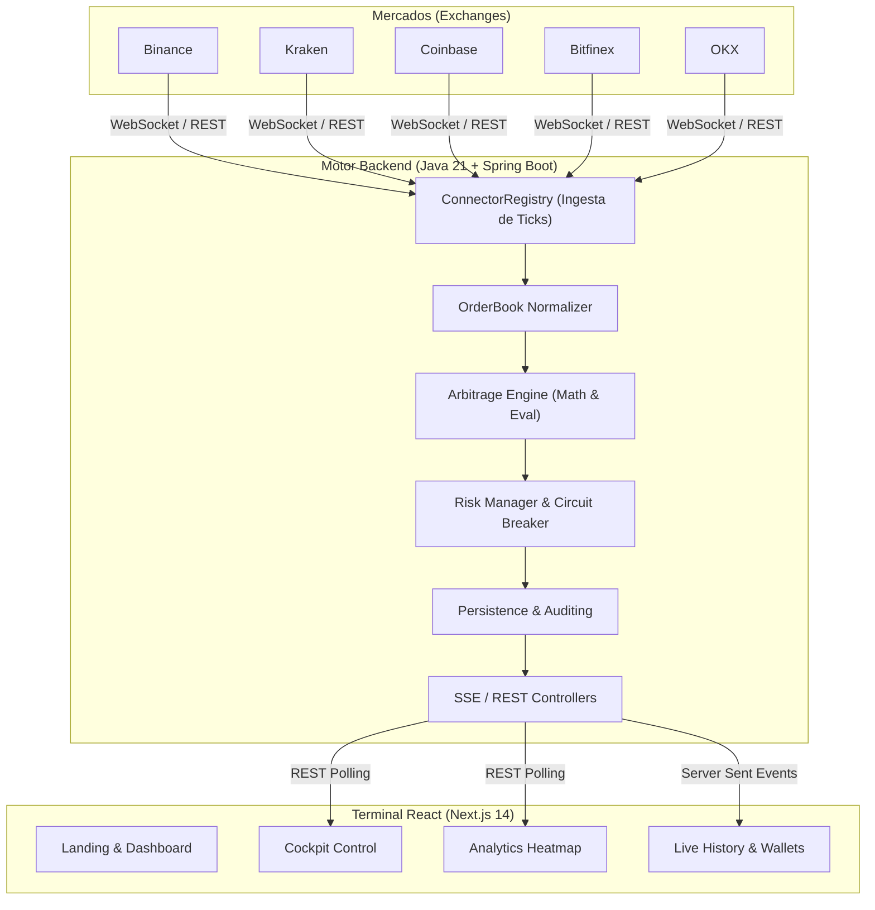

# NobaTrade 🚀

<p align="center">
  <strong>Motor de Arbitraje Criptográfico de Alta Frecuencia (HFT) con calidad institucional.</strong><br>
  <em>Desarrollado para el CODING_CHALLENGE_MEXICO</em>
</p>

<p align="center">
  <a href="https://github.com/javis">GitHub</a> ·
  <a href="https://www.linkedin.com/in/javis/">LinkedIn</a>
</p>

<p align="center">
  
  
  
  
  
  
</p>

---

## 📖 Visión General

**NobaTrade** no es un bot convencional; es un simulador de arquitectura de grado institucional diseñado para detectar ineficiencias de mercado (spreads) en milisegundos. Conecta de forma simultánea y asíncrona a múltiples exchanges globales, normaliza sus libros de órdenes (Order Books) en una estructura unificada y evalúa estrategias de arbitraje de manera continua.

Construido bajo el paradigma **Event-Driven**, NobaTrade delega todo el procesamiento matemático pesado a un Backend inyectado en esteroides (Java 21 + Spring Boot), mientras sirve a los usuarios finales una interfaz gráfica (Frontend en Next.js) que fluye en tiempo real sin saturar el navegador, gracias a un túnel de *Server-Sent Events (SSE)*.

---

## ✨ Características Principales y Diferenciadores

### 1. Motor Computacional Estricto (Backend)
- **Cero Errores de Precisión:** Todo cálculo financiero, spread y fee se procesa utilizando `BigDecimal`. Al eliminar la dependencia de primitivos de coma flotante (IEEE 754), evitamos los clásicos micro-descuadres matemáticos.
- **Conectores Concurrentes Asíncronos:** Ingesta de datos en paralelo desde **Binance, Kraken, Coinbase, Bitfinex y OKX**. El sistema es resiliente: si un WebSocket cae, el motor sigue evaluando con el resto de mercados sin bloquear el hilo principal.
- **Normalización Unificada:** Cada exchange transmite datos en su propio formato. Nuestro componente `OrderBook Normalizer` unifica el Bid y el Ask al instante para una evaluación cruzada.

### 2. Algoritmos de Arbitraje
- **Spatial Arbitrage (Cross-Exchange):** NobaTrade barre el mercado detectando dónde comprar barato y dónde vender caro simultáneamente cruzando 5 exchanges en tiempo real.
- **Triangular Arbitrage:** Evalúa el ciclo asimétrico entre múltiples pares dentro de un mismo exchange (Ej. USDT -> BTC -> ETH -> USDT) buscando ineficiencias matemáticas temporales.

### 3. Gestión de Riesgos Institucional
- **Circuit Breaker Automatizado:** Previene catástrofes de mercado frenando el motor de operaciones si detecta una alta volatilidad o caídas continuas.
- **Engine Cockpit:** Una consola de control para el usuario final que permite habilitar/deshabilitar mercados escuchados, ajustar márgenes mínimos de ganancia (Min ROI) y ejecutar pruebas de estrés (Flash Crash).

### 4. Interfaz UI/UX de Élite
- Diseño **Dark Mode Financiero Premium** que rivaliza con las plataformas de trading de Wall Street.
- **Micro-animaciones de celdas y tablas:** Cada orden que entra hace "flash" en la interfaz.
- **Modo DEMO Especializado:** NobaTrade incluye un "simulador de mercado frenético". Ideal para demostraciones y Hackathons, permite inyectar volumen sintético en la interfaz para probar la escalabilidad gráfica del UI y el crecimiento de PNL sin depender de la extrema volatilidad aleatoria del mercado real.

---

## 🏗 Arquitectura del Sistema

El proyecto sigue una arquitectura de microservicios contenerizada con estricta separación de responsabilidades:



---

## 🛠 Stack Tecnológico y Estructura

### Backend (`/backend`)
El corazón computacional. Escrito en **Java 21** para aprovechar Virtual Threads y un alto rendimiento concurrente.
- **Framework:** Spring Boot 3
- **Gestor de Paquetes:** Maven
- **Librerías Clave:** `WebFlux` para llamadas asíncronas HTTP, y `Jackson` para parsing veloz de JSON.

### Frontend (`/frontend`)
La cara del sistema. Optimizada para no sufrir pérdida de frames al recibir grandes volúmenes de datos por segundo.
- **Core:** Next.js 14 + React 18
- **Lenguaje:** TypeScript (Tipado estricto para las entidades financieras).
- **Estilos:** TailwindCSS para personalización de diseño rápido y utilitario.
- **Iconografía:** Lucide-React.

---

## 🚀 Despliegue Rápido (Quick Start)

Para evitar problemas de compatibilidad (ya sea Windows, Mac o Linux), todo el ecosistema de NobaTrade se orquesta mediante **Docker**.

### Prerrequisitos
- Docker y Docker Compose instalados.
- Ningún servicio ocupando los puertos `8080` y `3000`.

### Pasos de Instalación

1. Clona este repositorio y navega a la raíz:
```bash
git clone https://github.com/tu-usuario/nexustrade-fase1.git
cd nexustrade-fase1
```

2. Ejecuta el compilador y orquestador maestro:
```bash
docker-compose up -d --build
```

3. Abre el navegador web:
- **Terminal Web:** [http://localhost:3000](http://localhost:3000)
- **API Backend (Health):** [http://localhost:8080/api/status](http://localhost:8080/api/status)

*Para detener la aplicación:*
```bash
docker-compose down
```

---

## 🎯 Cumplimiento de la Rúbrica (Challenge)

| Criterio | Evidencia en NobaTrade |
|---|---|
| **Velocidad** | Ingesta concurrente y canal de comunicación SSE que elimina el *overhead* del polling continuo. |
| **Precisión** | Descarte total de floats. Motor financiero blindado con aritmética `BigDecimal`. |
| **Robustez** | Contenedores Dockerizados, tolerancia al fallo de WebSockets y `Circuit Breaker` operativo desde UI. |
| **Estrategia** | Modelos Multi-Exchange (Spatial) e Intra-Exchange (Triangular) operando simultáneamente. |
| **Arquitectura** | Desacoplamiento total entre motor matemático (Java) y motor visual (Node/React). |
| **UX/UI** | Tema oscuro institucional, tarjetas interactivas de arquitectura interna y un **Modo Demo** inyectable para exhibiciones deslumbrantes. |

---

## ⚠️ Límites Honestos y Trabajo Futuro

- NobaTrade ejecuta **Paper Trading** basado en datos en vivo; en la fase actual no requiere inyección de API Keys firmadas ni moviliza fondos reales.
- Las comisiones (Fees) aplicadas en el motor asumen un rango plano conservador (Taker fee global estándar). En producción real, estos variarían según el nivel de cuenta del usuario (Maker/Taker tiers).
- Si bien NobaTrade cuenta con un "Modo Demo", la ausencia de arbitrajes generados en el "Modo Live" refleja simplemente un entorno de mercado eficiente. **Cero operaciones es un resultado matemáticamente correcto cuando no existen oportunidades rentables post-comisiones.**

<p align="center">
  <br/>
  <b>NobaTrade</b> fue diseñado con pasión y precisión matemática.<br/>
  <i>CODING_CHALLENGE_MEXICO</i>
</p>
