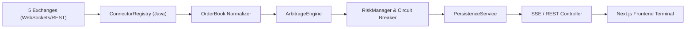

# NobaTrade

<p align="center">
  <strong>Inteligencia de arbitraje cripto con calidad institucional, construida para escalar.</strong>
</p>

<p align="center">
  <a href="https://github.com/javis">GitHub</a> ·
  <a href="https://www.linkedin.com/in/javis/">LinkedIn</a>
</p>

<p align="center">
  
  
  
  
  
</p>

NobaTrade es un sistema de arbitraje event-driven diseñado para `CODING_CHALLENGE_MEXICO`. Conecta feeds públicos en tiempo real, normaliza `order books` y evalúa rentabilidad con fricciones realistas y costos operativos. 

La plataforma divide limpiamente su lógica institucional:

- `Motor Backend (Java 21)`: Ingesta de datos multihilo, normalización de Order Books y evaluación algorítmica constante.
- `Shadow Learning & Persistence`: Auditoría en tiempo real de transacciones aceptadas y rechazadas.
- `Frontend Terminal (Next.js)`: Visualización del mercado en fracciones de segundo con gráficas dinámicas y un cockpit de control.

## Modos de Ejecución

| Modo | Propósito |
|---|---|
| `LIVE` | Trading terminal con feeds en tiempo real desde 5 mercados (Binance, Kraken, Coinbase, Bitfinex, OKX). |
| `DEMO` | Modo de simulación optimizado para demostración. Inyecta flujos sintéticos de alta frecuencia para comprobar la capacidad gráfica, llenar el historial de transacciones, probar la reactividad del UI y mostrar ganancias acumuladas en tiempo real sin requerir volatilidad extrema real. |

## Diferenciadores

### 1. Motor Realista Institucional

- `BigDecimal` nativo en Java para prevenir cualquier error de precisión en cálculos matemáticos (floating point).
- Manejo asíncrono y tolerante a fallos para reanudar conexión si un exchange se desconecta temporalmente.
- Evaluación estricta de liquidez en libros de órdenes.

### 2. Múltiples Mercados y Estrategias

- Integración en paralelo con **Binance, Kraken, Coinbase, Bitfinex, y OKX**.
- `CROSS_EXCHANGE (Spatial)`: Identifica desviaciones de precio entre el mejor Ask y el mejor Bid en dos recintos distintos.
- `TRIANGULAR`: Detecta ineficiencias matemáticas en ciclos de intercambio dentro de un mismo mercado.

### 3. Cockpit y Circuit Breaker

- Control de exposición de carteras y ROI mínimo directamente desde el UI.
- Activación o desactivación en vivo de los mercados escuchados.
- **Botón de Flash Crash (Pánico)**: Apaga el motor temporalmente mediante un *Circuit Breaker* en caso de volatilidad destructiva repentina.

## Arquitectura



El backend asimila la carga de mercado procesando los Ticks. La interfaz consume Server-Sent Events (SSE) logrando un UI extremadamente fluido sin saturar el cliente ni depender de un polling agresivo.

## Quick start (Docker)

El proyecto está 100% contenerizado para asegurar una ejecución determinista. Para arrancar toda la arquitectura:

```bash
docker-compose up -d --build
```

Abrir la plataforma en el navegador:

```text
http://localhost:3000
```

Health checks del Backend:
```text
Status: http://localhost:8080/api/status
Engine: http://localhost:8080/api/status/engine
```

## Seguridad e Infraestructura

Las configuraciones, redes y puertos se administran a través de `docker-compose.yml`. Las comunicaciones internas de microservicios permanecen aisladas bajo una red local virtual de Docker, exponiendo solo:

- `8080`: API Backend
- `3000`: Frontend React / Next.js

## Rubrica del challenge

| Criterio | Evidencia |
|---|---|
| Velocidad | Ingesta concurrente, procesamiento event-driven y uso de Server-Sent Events para latencia mínima. |
| Precisión | Tipado estricto matemático con `BigDecimal` en backend. |
| Robustez | Arquitectura dockerizada y `Circuit Breaker` de seguridad operable desde la interfaz web. |
| UX | Interfaz oscura premium institucional, microanimaciones de celdas, gráficas matemáticas del funcionamiento interno y un modo DEMO especializado para presentaciones efectivas. |

## Límites honestos

- El enfoque actual está centrado en `Paper Trading` simulado sobre precios en vivo reales, no moviliza fondos reales.
- Las comisiones asumidas usan un modelo fijo conservador (Taker fees globales).
- Cero ejecuciones puede ser un resultado matemático perfectamente correcto bajo un entorno de mercado lateralizado o baja volatilidad. Por ello se incluye el Modo Demo.

---

**Proyecto:** NobaTrade · `CODING_CHALLENGE_MEXICO`
